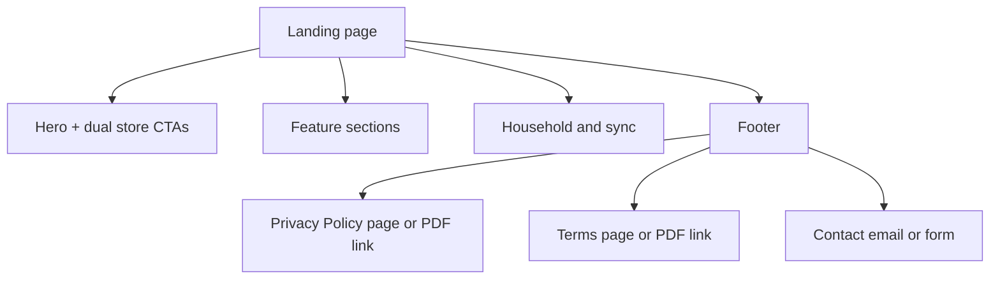

# Renity — informational marketing website (developer brief)

## Product summary (for the developer)

**Renity** is a household-focused mobile app for **recipe management**, **weekly meal planning**, **AI-assisted cook mode**, and **collaborative shopping lists**, with **real-time sync** across household members. It is built as a React Native / Expo app with Supabase backend ([readme.md](readme.md)).

**One-line pitch:** *Plan meals together, cook with guided steps, and shop from one shared place—built for households, not solo recipe boxes.*

**Publisher context (from config):** Bundle IDs / package `com.unravelcommerce.renity`; Expo owner `unravelcommerce` ([app.config.ts](app.config.ts)). Use only in copy if the client confirms public-facing company name.

---

## Goals and scope

| In scope | Out of scope (unless client adds later) |
|----------|----------------------------------------|
| Single informational landing experience (can be one long page or a few static routes) | App backend, auth, or user accounts |
| Clear value proposition + feature sections | Blog/CMS unless requested |
| Prominent **Download on the App Store** and **Get it on Google Play** (see URLs below) | In-app purchase flows on the web |
| **Placeholder** store URLs clearly labeled `TBD` in the implementation | — |
| Footer: **Privacy Policy**, **Terms** (links or anchor pages), **Contact / support** | — |
| Responsive layout, accessible contrast, fast static delivery | — |

**Assumptions to confirm with the client:** Primary **language** (default: English); **domain and hosting** (who buys DNS, who deploys); **social links** (optional footer icons: Instagram, X, etc.) only if accounts exist.

---

## Audience

- Home cooks and families who plan meals together  
- Households that want shared recipes, assigned cooks, and coordinated shopping  
- Users comparing meal-planning / recipe apps before install  

Tone: **clear, warm, practical**—aligned with onboarding themes (togetherness, less dinner stress).

---

## Feature pillars (content for sections)

Use these as section headings or cards; wording can be tightened by a copywriter.

1. **Recipes** — Create and organize recipes with images, ingredients, and steps; search personal and shared libraries; import from URLs (AI-assisted); share with household or email; copy shared recipes into your collection ([readme.md](readme.md)).  
2. **Meal planning** — Weekly planner, “today” view, assign who’s cooking, quick-add from recipes, configurable week start, real-time sync.  
3. **Cook mode** — AI step-by-step guides, multi-recipe mode, scaled servings, timers with notifications, progress save/resume (single-recipe).  
4. **Shopping lists** — Manual lists, AI generation from the planner (day or week), import from recipes, combining/conversion/categorization, assign lists with notifications, metric/imperial support.  
5. **Household** — Roles (admin / editor / viewer), invites, real-time updates, push notifications for assignments and shares.  
6. **Subscriptions (high level only)** — Personal vs family tiers, free trial; **no pricing required on the marketing page** unless the client wants parity with the app—readme lists limits at a glance if needed.

**Onboarding-aligned taglines** (from [app/(public)/welcome.tsx](app/(public)/welcome.tsx)):

- Recipe Book: *“Capture and share your favorite recipes… Build your personal cookbook together.”*  
- Plan Together: *“Create weekly meal plans with your household. Never wonder what's for dinner again.”*  
- Cook Mode: *“Follow step-by-step cooking guides with built-in timers… Cook multiple recipes at once.”*  
- Shop Smarter: *“Turn meal plans into organized shopping lists instantly.”*

---

## Visual design: align with the **live app** palette

**Source of truth:** [constants/Colors.ts](constants/Colors.ts) (central theme used by buttons, tabs, and UI).  

**Do not** use the purple `#6C4EF6` from older internal docs ([context/prd.md](context/prd.md)) for brand consistency—the shipped app uses the tokens below.

| Token | Hex | Usage on the website |
|-------|-----|----------------------|
| Primary | `#8F7872` | Primary buttons, key links, icons, focus rings |
| Secondary | `#C9B5B1` | Secondary buttons, soft borders, illustration accents |
| Background | `#f3f2ed` | Page background or large sections |
| Background light | `#FAFAFA` | Use this spelling on web; app file has a typo `FArFAFA` in [constants/Colors.ts](constants/Colors.ts) line 12 |
| Text primary | `#1C1C1E` | Headings and body |
| Text secondary | `#8E8E93` | Supporting text |
| Border | `#E5E5EA` | Dividers, cards |
| Success | `#34C759` | Optional positive micro-copy |
| Error | `#FF3B30` | Sparingly (errors in forms only if contact form exists) |

**Optional accent:** Android notification tint in [app.config.ts](app.config.ts) is `#FF6B35`—use **only** if a second accent is needed (e.g. subtle highlights); primary brand remains taupe.

**Logo / assets:** Reference paths from the repo for export to the web developer:  
`assets/Logo/Renity_Logo_Icon_03.png` (app icon), `Renity_Logo_with_text.png` (splash), `Renity_Logo_android_02.png` (Android adaptive foreground). Client should supply **SVG or high-res PNG** exports for the web.

**Design direction:** Modern, generous whitespace, subtle cards or bento-style grids, restrained motion (respect `prefers-reduced-motion`). Typography: a clean **sans-serif** pairing (system stack or licensed web fonts)—no requirement to match RN font files unless specified.

---

## Information architecture (suggested)

- **Hero:** App name, short value prop, both store buttons (placeholder `href="#"` or `TBD` with a visible note in the brief for the developer).  
- **Mid-page:** Feature pillars (icons optional).  
- **Optional:** Single screenshot or device mockup row (client provides assets).  
- **Footer:** Privacy, Terms, Contact; optional copyright line.

---

## Optional additions (often useful; include if relevant)

- **Favicon and touch icons** — Provide or generate from logo (multiple sizes for browsers and `apple-touch-icon`).  
- **Social / messaging previews** — Beyond basic SEO: **Twitter/X Card** and consistent **Open Graph** image (typical **1200×630**); one asset covers most platforms.  
- **Smart App Banner (iOS)** — Optional `<meta name="apple-itunes-app">` once the App Store ID is known; helps Safari users jump to the store. **Android** has no identical one-liner; store buttons remain primary.  
- **App deep link** — App scheme is `renity` ([app.config.ts](app.config.ts)); useful only if the site adds “Open in app” later—not required for a static brochure.  
- **Cookie consent / GDPR** — If you add **analytics** or marketing pixels, EU visitors may need a cookie banner and updated Privacy Policy; analytics-free static sites often avoid this. Call out in the brief if trackers are planned.  
- **Contact form hardening** — If using a form (not just `mailto:`), specify **spam protection** (honeypot, Cloudflare Turnstile, etc.) and who receives submissions.  
- **Press or media** — Optional single **press@** or downloadable **press kit** (logos, approved screenshots, short boilerplate).  
- **Compatibility line** — Optional one line: “Requires iOS / Android versions as listed on the App Store and Google Play” once listings are live—avoid hardcoding OS versions in the repo.  
- **404 page** — Simple branded not-found page for static hosting.  
- **Screenshot / mockup rights** — Marketing images should be **app-owned or licensed**; onboarding art in the app may use third-party photos—do not assume those are cleared for the public website without checking.

---

## Store links (per your choice)

- **App Store:** `TBD` — placeholder until `https://apps.apple.com/...` is available.  
- **Google Play:** `TBD` — placeholder until `https://play.google.com/...` is available.  
- Implement buttons with standard Apple / Google badge artwork (official guidelines) so swapping URLs is trivial.

---

## Privacy, terms, contact

- **Privacy Policy** and **Terms:** Link to final URLs or static pages; if not ready, stub routes with “Coming soon” or PDFs provided by legal.  
- **Contact:** Mailto or a simple form posting to a serverless endpoint—**client decides**; the brief should state the support email placeholder (e.g. `support@…`) to be filled in.

---

## Non-functional expectations

- **Performance:** Static or SSG-friendly; optimized images (WebP/AVIF), no heavy client JS for a simple landing page.  
- **Accessibility:** Semantic HTML, keyboard navigation, visible focus, sufficient contrast using the palette above.  
- **SEO:** Title, meta description, Open Graph image (client-provided), canonical URL.  
- **Analytics:** Optional (Plausible, GA4)—only if the client requests; not required for MVP. If enabled, coordinate with **Privacy Policy** and optional **cookie consent** (see optional additions).  
- **Security (baseline):** HTTPS in production; security headers where the host allows; no sensitive data in client-side env for a static site.

---

## Deliverable for the developer (what you send)

A single document containing: (1) this summary, (2) color table, (3) feature list, (4) footer requirements, (5) placeholder store URLs, (6) asset list and logo paths, (7) explicit **out of scope** list, (8) **assumptions** (language, domain, hosting), (9) optional items from “Optional additions” as applicable. No code changes in the Renity app repo are required for this phase—only the brief and exported brand assets.

---

## Plan review (what was missing and is now covered)

The original brief was strong on product story, palette source-of-truth, scope, and store placeholders. Gaps addressed in this revision:

| Gap | Resolution in plan |
|-----|-------------------|
| Favicon / social preview assets | Optional additions + todo `web-assets` |
| Domain, hosting, who deploys | Assumptions block + todo `hosting-domain` |
| GDPR / cookies vs analytics-only site | Cookie consent note tied to analytics |
| Contact form abuse | Spam protection line |
| Smart App Banner / deep links | Optional, documented |
| Image licensing for marketing | Screenshot rights warning |
| Branded 404 | Optional additions |
| Press / media | Optional press kit |
| OS version claims | Defer to store listings |
